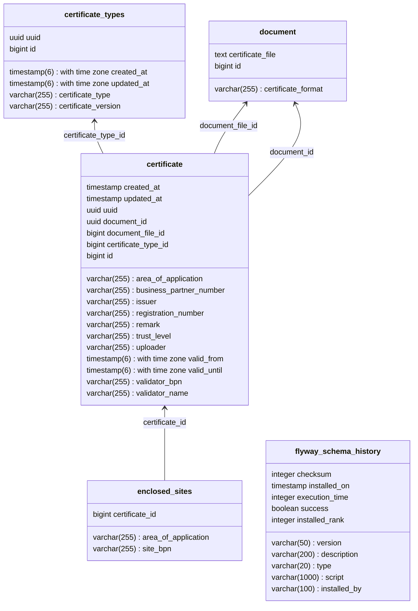

## mermaid file content

This is simple example where i can take any flow diagram which may be in mermaid or any other representation.
and can be shown in below. and on browser you can see result.

